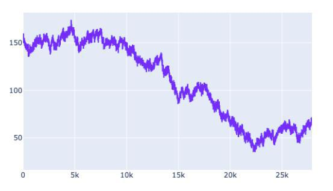

# Reinforcement Learning (CSE564) Project

Adapted from Ha and Schmidhuber, "World Models", 2018. Refer [original project page](https://ctallec.github.io/world-models/).

## Introduction

We extend the Model Based World Model RL algorithm by updating in the following specifics:
- Use a vanilla autoencoder for the vision (V) model. The authors mention that they use a variational autoencoder to constrain and impose a gaussian distribution over the sampled state latents. We hypothesise that removing the gaussian constraint might work better since we do not constrict the state latents to a distribution.
- Use the [PEPG (Parameter Exploring Policy Gradients) evolutionary algorithm](http://citeseerx.ist.psu.edu/viewdoc/download;jsessionid=A64D1AE8313A364B814998E9E245B40A?doi=10.1.1.180.7104&rep=rep1&type=pdf) to converge to the global maxima. A particular weakness of the CMA-ES method is that it discards the majority of the solutions in one generation, and keeps only the top n% of solutions. Weak solutions might contain information too that might help in the convergence. Refer [this blog](http://blog.otoro.net/2017/10/29/visual-evolution-strategies/) for a concise explanation

## Running models

- To train the autoencoder and variational autoencoder, run the trainvae.py and trainae.py scripts.
- To train MDN-RNN network using autoencoder and MDN-RNN using variational autoencoder, run the trainmdrnn.py and trainmdrnn_ae.py
- To train the controller network using CMA-ES/PEPG with VAE/AE forward passes, train the corresponding files from: traincontroller_cmaes_ae.py, traincontroller_cmaes_vae.py, traincontroller_pepg_ae.py, traincontroller_pepg_vae.py

## Analysis

- 
- 

Note: Code adapted from [here](https://github.com/ctallec/world-models)